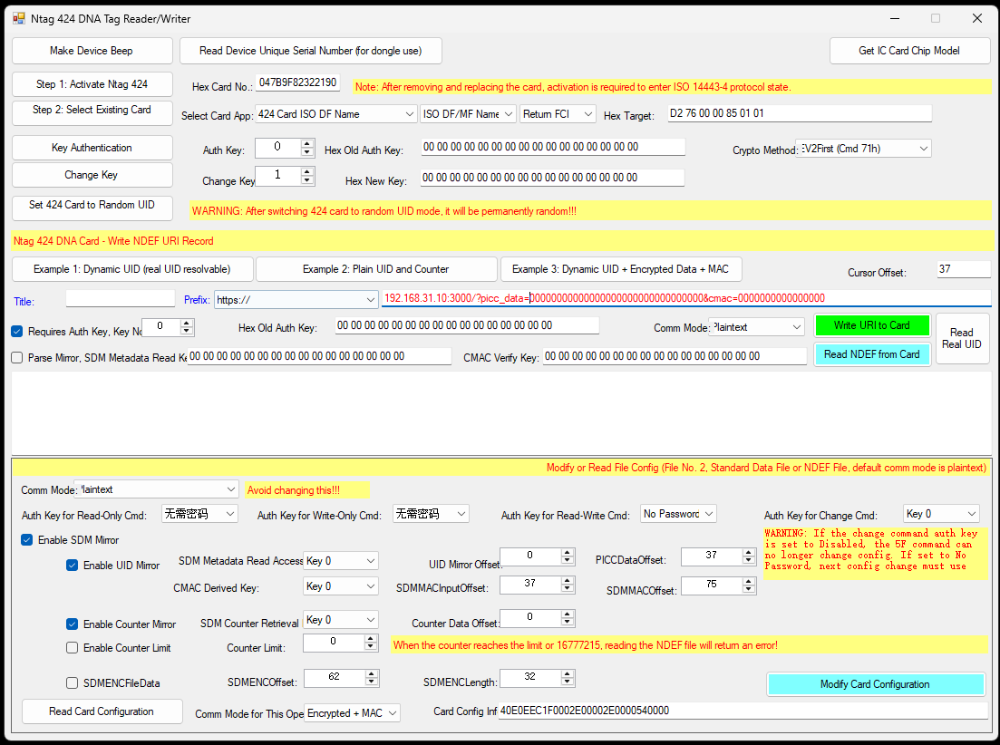

# Ntag424DNA

Ntag424DNA is a Windows Forms application written in C# designed for interacting with NTAG 424 DNA NFC tags. It provides an interface to communicate with an RFID/NFC reader (via `OUR_MIFARE.dll`) and perform advanced and secure operations on NTAG 424 DNA tags.

## Screenshot

## Features

- **Device Information**: Read device serial number and IC card chip model.
- **Card Activation**: Support for Desfire and Fm1208 CPU cards.
- **NTAG 424 DNA Core Operations**:
  - Secure EV2 authentication.
  - Modify tag keys and access conditions.
  - Setup and configure Secure Dynamic Messaging (SDM) / SUN (Secure Unique NFC).
  - Write and Read NDEF messages (URI).
  - Modify file settings and parameters.

## Requirements

- .NET Framework (Windows Forms)
- Compatible PC/SC or proprietary NFC/RFID reader.
- `OUR_MIFARE.dll` properly configured and placed in the executable directory.
